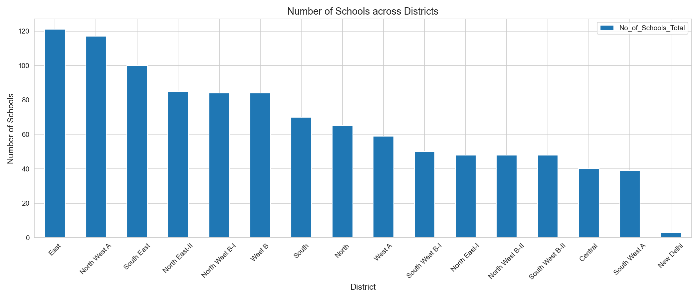
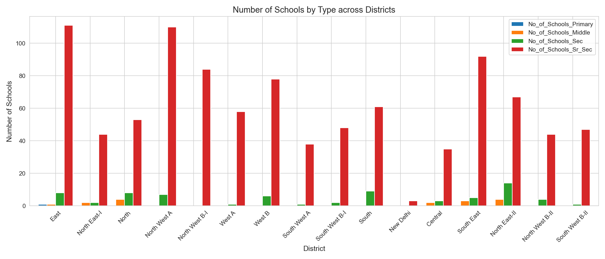
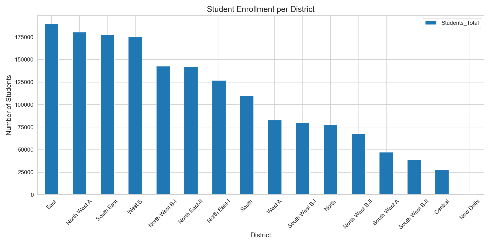
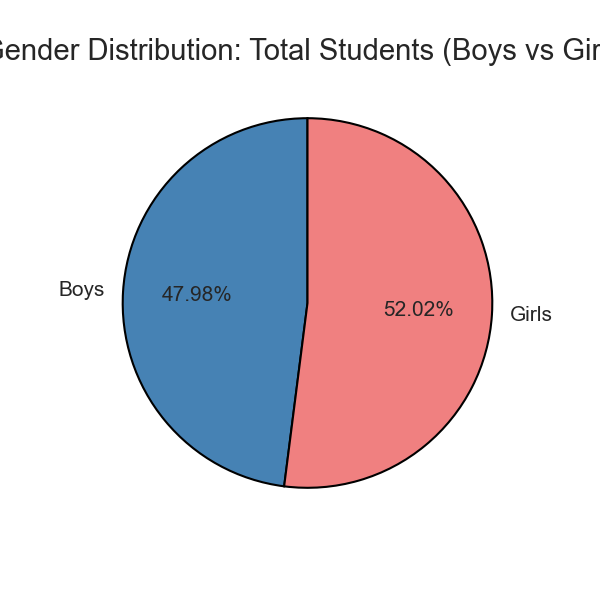
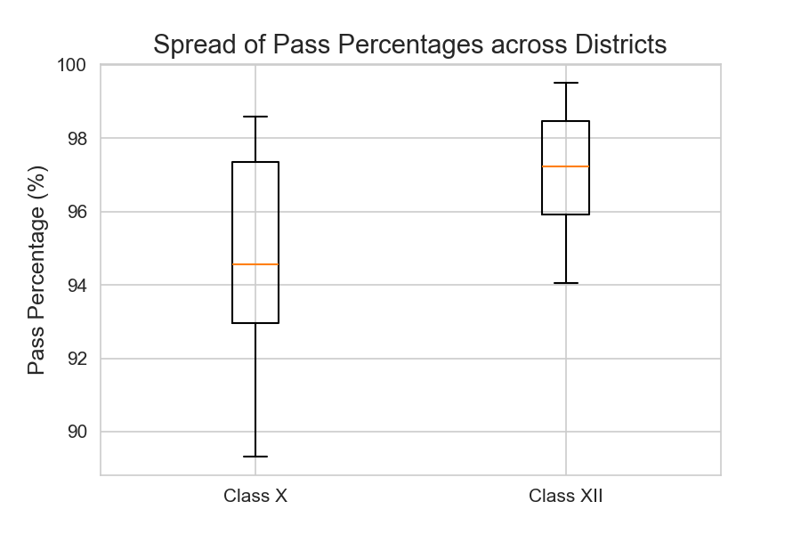
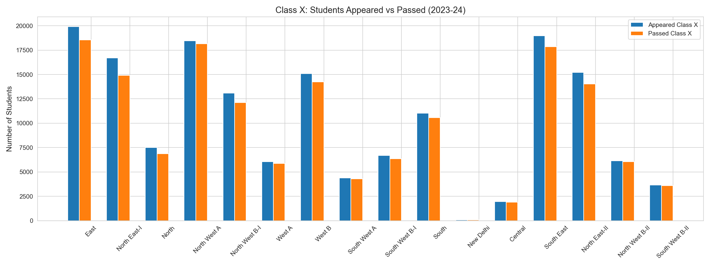
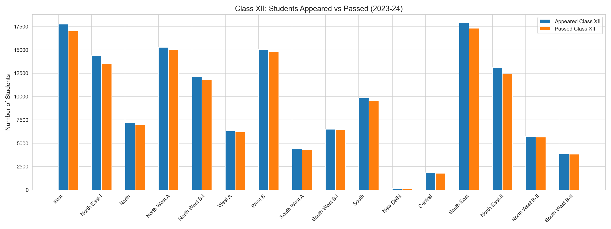

# Data-visualization

## Data Source
Dataset Name: Delhi Government School Details

Dataset Description - The data contains district wise Number of Schools, Student Enrollment , Pass Percentage and Quality Index for Class X and XII

Source Link: [https://www.data.gov.in/files/ogdpv2dms/s3fs-public/EducationDataset_2023-24.csv]

Department/Ministry: Education Department, Govt. of NCT of Delhi

## Analysis

School & Student Analysis Across Districts
This document summarizes the key findings derived from a series of bar charts and box plots analyzing school infrastructure, student enrollment, and academic performance across various administrative districts.

1. School Infrastructure Analysis

The analysis of school count and school type across districts revealed major structural biases:

Highest Concentration: The East district possesses the highest number of schools, with approximately 120 institutions.

Lowest Concentration: The New Delhi district consistently registers the lowest number of schools, typically 3-4.

Variation: There is significant imbalance, with districts like North West A and South East also showing high counts, while others lag far behind.

School Type Distribution 

Dominant Type: There is an overwhelming dominance of Senior Secondary Schools in nearly every district. For example, East and North West A have ≈110 Senior Secondary Schools each.

Scarcity: The counts for Primary, Middle, and Secondary schools are negligible in comparison, often registering near zero, suggesting that most formal educational institutions are structured at the highest level.

2. Student Enrollment Analysis
Enrollment data shows a strong correlation with the number of schools and highlights a clear gender trend.

Highest Enrollment: The East district leads with the highest student enrollment, reaching ≈18,000 students.

Distribution: Enrollment volume generally mirrors the school count, with North West A and South East following closely, and New Delhi registering enrollment near zero.

Female Majority: The overall student population shows a slight skew toward female enrollment:

Girls: 52.02%

Boys: 47.98%

Gender Enrollment by District (boys_girls_district.png)

Girls Outnumber Boys: In the majority of districts (e.g., East, North East-I, South East), the number of enrolled girls is visibly higher than the number of enrolled boys.

Balance: North West B-I shows the most balanced gender ratio.

3. Academic Performance Analysis
Analysis of examination data confirms a high overall pass rate and less variability at the higher grade level.

The analysis of the spread of pass percentages across districts reveals that the median pass rate for Class XII (≈97.2%) is significantly higher than the median for Class X (≈94.5%). Furthermore, Class XII results show less variability and a narrower spread across districts, ranging from approximately 94% to 99.5%. In contrast, the Class X pass rates have a wider spread, ranging from ≈90% to 98.5%, indicating greater inconsistency in performance across different districts at the secondary level.

High Pass Rate: For both classes, the number of students passed (orange bars) is only marginally lower than those who appeared (blue bars), confirming a very high pass percentage across the system.

Student Drop-off: High-volume districts (like East and South East) show a higher number of students appearing for Class X than for Class XII, suggesting a moderate drop-off in student population between the two educational levels.
